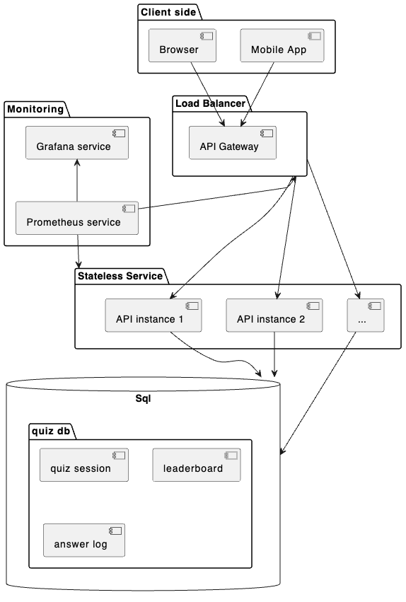

# Real-Time Vocabulary Quiz Coding Challenge

### Part 1: System Design

1. **System Design Document**:
 - **Architecture Diagram**:

- **Component Description**: 
    - Client side: include Browser or Mobile app interact with system throw API gateway.
    - Load Balancer: distribute request to stateless services(pods)
    - stateless services: main service handler business logic(realtime vocabulary qiz)
    - Monitoring: collect metrics from API gateway and stateless service and visualization
    - Sql database: main storage contents quiz, session config, info, leaderboard ...

- **Data Flow**: When user submit the answer. We will record the answer_logs of user check the answer correct or not and then we will update score to leaderboard table. Leaderboard will read direct from this table. All operations should be a transaction. Answer_logs table can be design to prevent duplicate (spam) answer with primary key `session_id, participant_id, quiz_id`

- **Technologies and Tools**: 
    - Kubernetes, Docker
    - API Gateway: Kong gateway, Nginx gateway
    - Monitoring: Prometheus, grafana to visualization
    - Sql: postgresql, mysql, cloud sql.